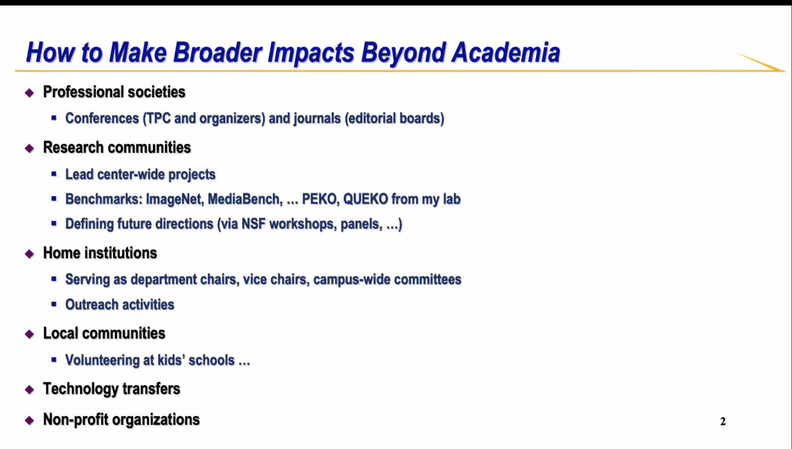
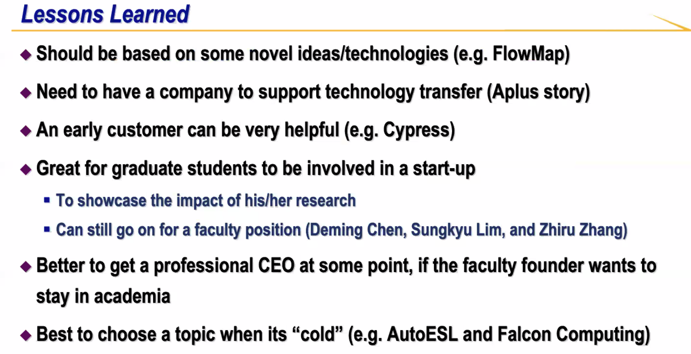
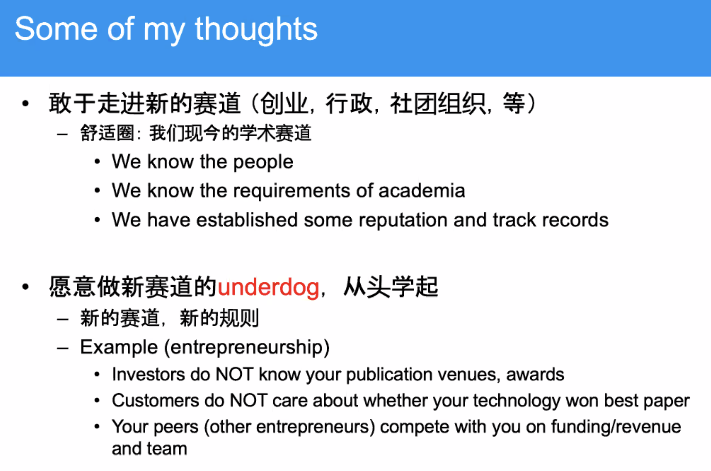

# 《专题研讨：如何在学术界之外产生更广泛的影响》简记

# Kai Li
- 在美国做科研，和黑人开车一样，容易被停
- 做老师：主要是鼓励
- 做企业：不断满足市场，满足客户要求，有Roadmap
- 做社区：不用能力很强，只要心明确

# Jason Cong

- UC允许20%时间做咨询
- 确保有强大的团队，保证可以应对各种问题
- 只有startup才能把超新的tech转化到工业界（EDA非常复杂，光open-source不够）；talent-transfer

# S Joe Qin
对年轻学者的建议：
- 要有长远目标
- 意识到自己的优势与潜力，并发挥
- 从大局考虑问题，勿为生计忧
- 为社会做贡献

# Yuanyuan Zhou

## Find your own strength
- Research projects/directions
- Products & startups
- **Leadership starts from self-awareness**
## 学术和创业
- 创业可以发现技术挑战，启发研究热情
E.g., YYZhou在创业期间发现花了大量经历在debugging，因此决定从存储/内存管理转为找bugs。
- 敢于走出新赛道（创业、行政、社团）
- 空杯
- 搞Whova纯粹因为好玩，没必要融那么多钱
- 为什么敢去创业：因为有前辈可以follow，不犯怵
- UI：未来8个月内的可以License给你，让你作为公司的东西
- 性格好强，现场争强后，回头再想想，到底有没有道理
- do things that matter, don't play the paper game
- 来自Kai的提醒：如果没有文章，需要小心，保持持续输出

# Song Han

- 好的导师，好的mentor很重要
- 所有的工作都要open-source
- 每个工作都能repeat，都能让人用