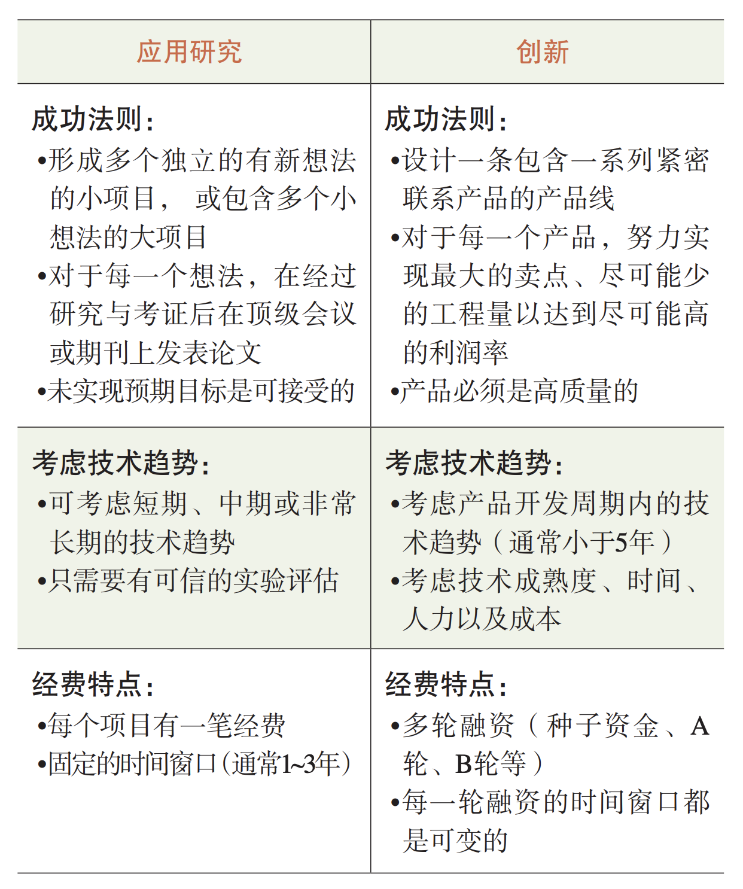
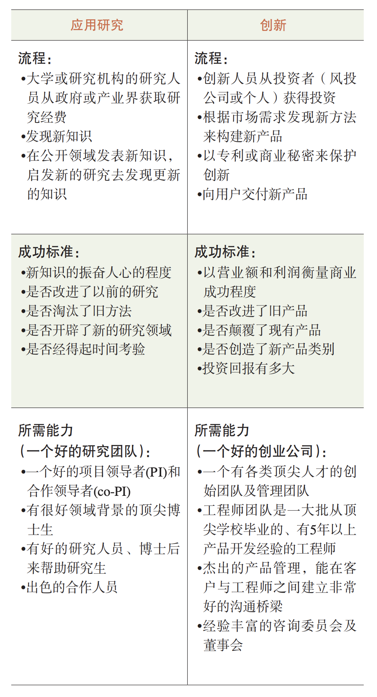
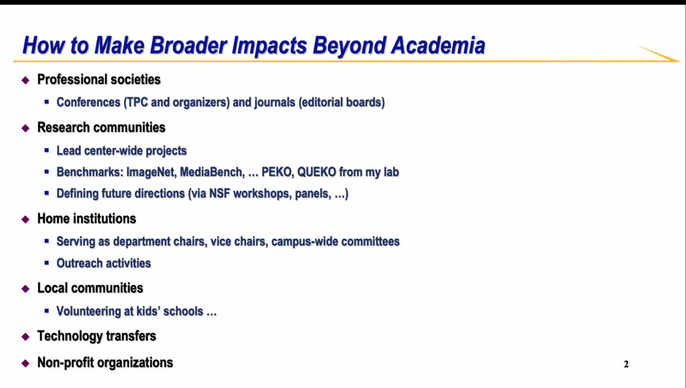
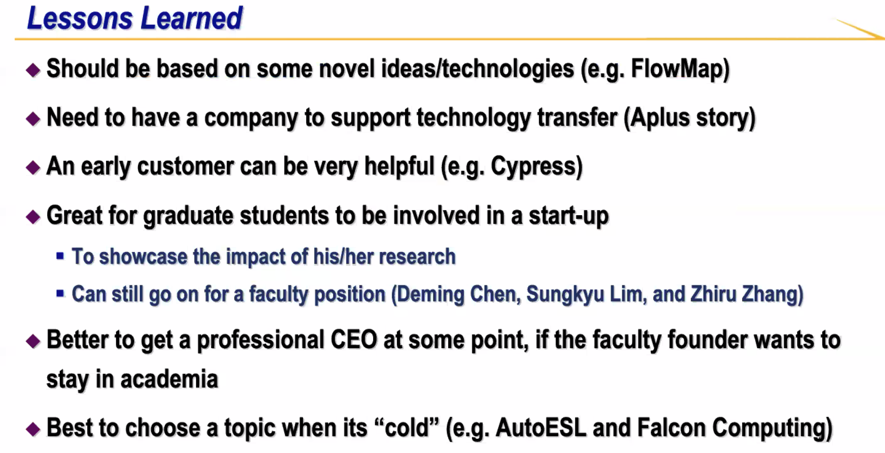
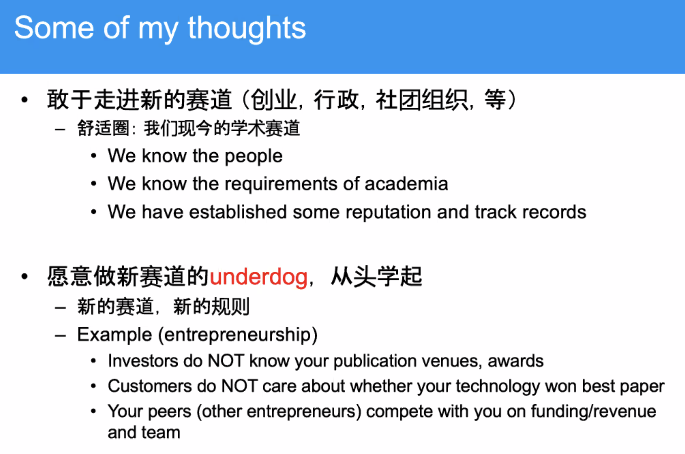

# 《专题研讨：如何在学术界之外产生更广泛的影响》简记

# Kai Li
- 在美国做科研，就和黑人开车一样，容易被叫停
- 做老师：主要是鼓励学生
- 做企业：不断满足市场，满足客户要求，有明确的roadmap
- 做社区：不用能力很强，但要目标明确
- 研究：投入金钱，转换成知识
- 创新：将知识变现

> Dr. Geoff Nicholson: Research is the transformation of money into knowledge. Innovation is the transformation of knowledge into money. Creativity is thinking but innovation is doing, if you have an idea you should have the passion to do something about it. (source: https://www.hardwarezone.com.sg/feature-dr-geoff-nicholson-father-post-it-notes-3m-innovation)

> Jobs WWDC 1997：成功的创新是市场驱动的，而不是技术驱动。“你必须从用户体验出发，考虑需要什么技术……你不能从技术出发，然后考虑该卖到哪里去。”

Source: http://www.valleytalk.org/wp-content/uploads/2014/06/KaiLi.pdf

# Jason Cong

- 所处学校允许20%时间做咨询
- 确保有强大的团队，保证可以应对各种问题
- 只有startup才能把超新的tech转化到工业界（EDA非常复杂，光open-source不够）；talent-transfer

# S Joe Qin

对年轻学者的建议：
- 要有长远目标
- 意识到自己的优势与潜力，并发挥
- 从大局考虑问题，勿为生计忧
- 为社会做贡献

# YY Zhou

## Find your own strength
- Research projects/directions
- Products & startups
- **Leadership starts from self-awareness**

## 学术和创业
- 创业可以发现技术挑战、启发研究热情：YYZhou在创业期间发现花了大量经历在debugging，因此决定从存储/内存管理转为找bugs
- 敢于走出新赛道（创业、行政、社团）
- 能空杯
- 搞Whova纯粹因为好玩，没必要融那么多钱
- 为什么敢去创业：因为有前辈可以follow，不犯怵
- 所处的学校可以将未来8个月内的技术License给你，让你作为公司的东西
- 性格要强：在人前争强好斗后，回头再想想，到底有没有道理（不能为了强而强）
- do things that matter, don't play the paper game
- 来自Kai的提醒：如果没有文章，要小心，请保持持续输出

# Song Han

- 好的导师，好的mentor很重要
- 所有的工作都要open-source
- 每个工作都能repeat，都能让人用
